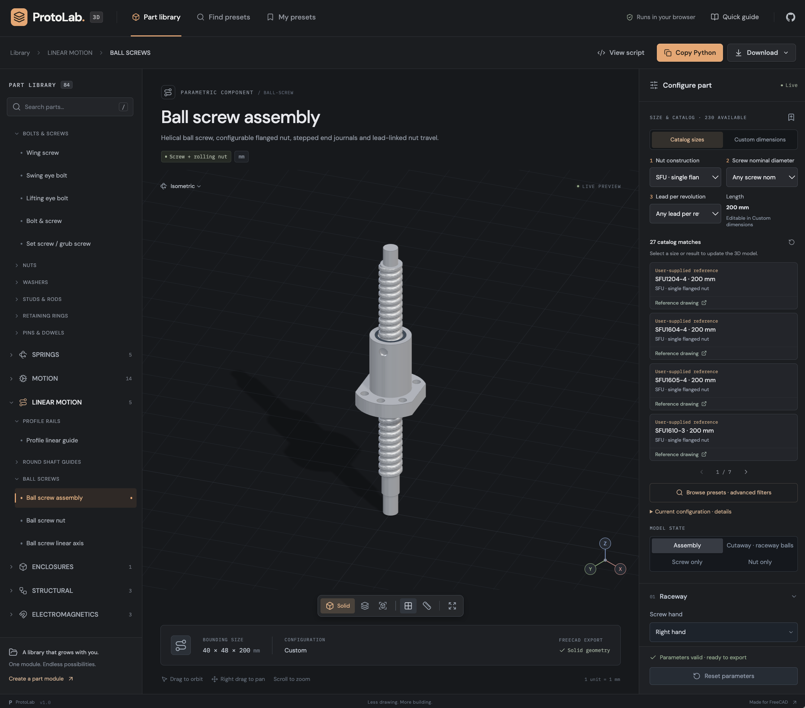

# ProtoLab 3D

A browser-based library of configurable mechanical parts for quick FreeCAD prototyping. Find a component in the category tree, adjust its dimensions, inspect its 3D preview, and bring the generated solid geometry into an existing FreeCAD document.



The application is a static React / TypeScript / Three.js site built with Vite. It runs without a backend and is suitable for GitHub Pages. The interface, generated Python, and source comments are in English.

## Run locally

Use Node.js 22 or later.

```sh
npm ci
npm run dev
```

Open the local URL printed by Vite. The default development port is `8080`, with the application at `http://localhost:8080/`.

```sh
npm run typecheck
npm test
npm run build
npm run preview
```

The production output is `dist/`. Vite uses `/` as the base for the custom domain `https://protolab.defencore.com/`, including JavaScript, styles and reference images. The GitHub Actions Pages workflow builds and uploads this directory; enable **Settings → Pages → Source → GitHub Actions** and set the custom domain in the repository. Deploying instead to a repository URL such as `https://defencore.github.io/ProtoLab-3D/` requires changing the Vite base to `/ProtoLab-3D/` before rebuilding.

## Working with parts

- Browse category → subgroup → component, or press `/` to search names, descriptions, keywords, and preset sizes.
- Use **Catalog sizes** in the configurator for everyday selection. For bolts and screws, choose thread → length → head → drive. Each choice narrows the remaining catalog options and automatically selects a matching part in the 3D preview. Matching product cards, counts and supplier links remain beside the model; clicking a card applies it immediately.
- Switch to **Custom dimensions** to enter precise numeric dimensions and fine-tune the geometry.
- Open **Browse presets** for advanced searches by designation, standard, manufacturer, supplier SKU or source. Its sidebar keeps the model visible while you filter by category, part type, numeric ranges and shape choices. Clicking a result immediately updates the model and its parameter review.
- **Find matching** turns the current part's main dimensions and choices into editable search conditions. Remove individual conditions or widen their From/To ranges. Blank endpoints are unbounded, and both ends of a range are included. Browse all bearing types to compare available bore/outside diameter/width combinations.
- Choose a sourced catalog preset, a prototype example, or enter your own dimensions. Invalid configurations display an explanation and disable export.
- Orbit, pan, and zoom the preview. Use the camera and rendering controls to inspect the model.
- Where available, select an assembled/exploded bearing state or a free/loaded spring state. The selected state is used by every export.
- Save named presets in this browser. Presets use local storage and are not synced to another device.

**Copy Python** puts a one-line `exec(...)` command on the clipboard. In FreeCAD, open **View → Panels → Python console**, paste the command, and press Enter. The macro adds a single solid as a `Part::Feature`, or an assembly as an `App::Part` containing independently selectable component features. Expand the assembly in the model tree to hide components or change their **Placement**; moving the parent moves the complete assembly. The macro uses the active document, creates a document if necessary, and wraps creation in a transaction.

The download menu provides:

| Format                     | Result                                                                                                    |
| -------------------------- | --------------------------------------------------------------------------------------------------------- |
| FreeCAD macro (`.FCMacro`) | Standalone Python that constructs OpenCASCADE solid geometry in FreeCAD.                                  |
| STL (`.stl`)               | Binary triangle mesh of the current preview, with coordinates in millimetres.                             |
| Parameters (`.json`)       | Part ID, dimensions, model state, format version, and units. This is configuration data, not a CAD model. |

For STEP, run the macro in FreeCAD, select the created object, and use **File → Export**. Use **File → Save** for an FCStd document. The browser does not run the FreeCAD geometry kernel.

## Included library

The library uses independent part modules, including the requested bearing families, fasteners, springs, guides and transmissions. The live library displays the current module count.

The category tree and preset browser share the same functional order. Primary components precede their accessories within each subgroup; each module appears once. The organization follows assembly function: structure and fastening, passive mechanics, actuation, electronics, then flow surfaces.

| Section                 | Contents                                                                                      |
| ----------------------- | --------------------------------------------------------------------------------------------- |
| STRUCTURAL PARTS        | Aluminium profiles, brackets, enclosures, wheels and rollers                                  |
| FASTENERS               | Bolts, nuts, washers, spacers, studs, pins, retaining rings and lifting eyes                  |
| BEARINGS & SEALS        | Rolling and plain bearings, mounted units, mounting sleeves and shaft seals                   |
| LINEAR MOTION           | Profile/round guides, linear bushings, ball screw systems and gear racks                      |
| TRANSMISSION & LINKAGES | Gears, shaft couplings, one-way clutches, joints, rod ends, pistons and connecting rods       |
| SPRINGS                 | Compression, extension, torsion and spiral springs                                            |
| MOTORS & ACTUATORS      | NEMA steppers, BLDC motors, servo motors and their horns/spline gears                         |
| PNEUMATICS & GAS        | CO₂ gas cartridges with threaded and smooth necks                                             |
| ELECTROMAGNETICS        | Tubular/open-frame solenoids and holding magnets                                              |
| POWER & MOTOR CONTROL   | Batteries & cells, BEC regulators, single/four-in-one ESCs and DC-DC converters               |
| ELECTRONICS & VISION    | Single-board computers, microcontroller families, flight controllers, LoRa radios and cameras |
| VEHICLE STRUCTURES      | Wings, canards, control surfaces and hydrofoils                                               |

**VEHICLE STRUCTURES** adds 54 lightweight, editable configurations across [aircraft airframes](src/parts/aircraft-airframe/README.md), [model rocket airframes](src/parts/model-rocket-airframe/README.md), [boat hulls](src/parts/boat-hull/README.md) and [multicopter frames](src/parts/multicopter-frame/README.md). Fourteen popular-model references (Flite Test/ATOMRC/FMS, Estes, Pro Boat/Joysway, GEPRC/Holybro) sit alongside 40 custom design examples. Aircraft include 15 presets spanning high/mid/low wings, gliders, flying wings, deltas, canards, twin booms and tandem wings, with separate control surfaces. Boat hulls include 17 presets with six bottom sections, monohull/catamaran/trimaran/pod layouts, adjustable bow and stern, rocker, sheer and crossbeam forms. Use **Browse presets** to pick a reference, then edit dimensions directly. References are explicitly approximate: only their listed source dimensions are verified, and none are factory CAD. Assemblies retain a small number of named solids; body-only and exploded views are included. Multicopter frames include all 12 Quad/Hexa/Octa topologies from the supplied diagram, including H beams and coaxial pairs. See the [scope and verification guide](docs/vehicle-frames.md) and [full library hierarchy](docs/library-structure.md).

Category and subgroup assignments belong to each part package. `src/core/library.ts` controls navigation order and category icons; imported categories and subgroups remain discoverable after the built-in ones.

**PNEUMATICS & GAS → GAS CARTRIDGES** adds [CO₂ cartridges](src/parts/co2-cartridge/README.md): 12 fixed Leland models spanning 8, 12, 16, 20, 25, 33, 38 and 45 g. Includes threaded and smooth-neck 16 g versions, source body/neck dimensions, rounded external bodies and geometric 3/8″-24 or 1/2″-20 UNF threads. The fill mass, connection and dimensions are searchable; undimensioned cap and shoulder details are explicitly approximate.

**FASTENERS & THREADS → THREAD GEOMETRY** provides [internal and external thread solids](src/parts/thread-tool/README.md) for FreeCAD **Cut / Union**, with 79 metric M1–M68, UNC, UNF (including 3/8″-24), UNEF, basic Tr and ACME presets. Set custom diameter, pitch in mm/TPI, length, left/right hand, starts and radial allowance; custom profiles also expose angle, depth and crest width. Each export is a single closed solid. Internal tools remove both the bore and thread; external tools fuse to an overlapping base. Profiles are nominal design geometry, without certified fit classes or tapered pipe threads.

**VEHICLE STRUCTURES → WINGS & CONTROL SURFACES** adds a [Wing / canard / hydrofoil builder](src/parts/lifting-surface/README.md) with 11 editable examples. Select NACA four-series, double-wedge or biconvex root/tip profiles; adjust span, chords, quarter-chord sweep, kink, dihedral, twist, edge thickness and mirrored or vertical placement. Root and tip sections can be inspected separately. It creates CAD geometry for air or water concepts; aerodynamic, hydrodynamic and structural qualification require separate calculations.

| Category                | Components and variants                                                                                                                                                                                       |
| ----------------------- | ------------------------------------------------------------------------------------------------------------------------------------------------------------------------------------------------------------- |
| Bearings                | Deep groove, self-aligning, single/double-row angular contact and double-row radial ball bearings                                                                                                             |
| Bearings                | Cylindrical, spherical, tapered and drawn-cup needle roller bearings                                                                                                                                          |
| Bearings                | Rod ends, LM/LMK/LMF ball bushings, ball/cylindrical/spherical thrust bearings, combined needle/ball and needle/axial roller bearings                                                                         |
| Bearing accessories     | Pillow blocks including KP08/KP001 cast supports and UCP housings, two/four-bolt flange units, UC inserts, drawn-cup and CSK one-way clutches, spherical plain bearings, adapter sleeves and radial oil seals |
| Fasteners               | Bolt & screw: hexagonal, countersunk, pan, button, socket cap and custom polygon heads                                                                                                                        |
| Fasteners               | Independent drive: none, hex, slot, cross, six-lobe, square and custom polygon                                                                                                                                |
| Fasteners               | Wing screws, swing-eye bolts and lifting-eye bolts; set / grub screw, including an M2.5 × 8 cone-point preset; flat, chamfered, cone, dog and cup points                                                      |
| Fasteners               | Hex, thin, high, coupling, square, flange, nylon-lock, all-metal-lock and domed nuts; wing/eye nuts; washers; circlips and E-rings; spring/cotter pins; threaded rods                                         |
| Springs                 | Compression: cylindrical, conical, barrel and hourglass, with open or reduced-pitch ends                                                                                                                      |
| Springs                 | Extension: independent full eyes, open hooks, side eyes or straight tails, with end-plane rotation                                                                                                            |
| Springs                 | Torsion with independent legs and bends; double torsion; flat spiral strip                                                                                                                                    |
| Motion                  | Spur, helical/herringbone and approximate bevel gears; worm drive; straight rack; utility wheel                                                                                                               |
| Linear motion           | Profile rail and round-shaft guide with moving carriages, recirculating balls and cutaway views                                                                                                               |
| Linear motion           | Ball screw assemblies and standalone nuts: SFK, SFU, SFS, SFE, DFU, SFI, DFI, SFH and SFY; machined ends and helical ball raceways                                                                            |
| Linear motion           | Ball screw linear axis: six prototype presets with dual profile rails, moving table, fixed/floating bearing supports and cutaway view                                                                         |
| Motion                  | D25 L30 jaw coupling with independent bores, clamp screws and elastomer spider; six dimensioned bevel gear pairs; miniature m0.5 pinions                                                                      |
| Electric motors         | NEMA stepper motor: nine fixed NEMA 8–42 models; BLDC motor: 24 variants, from micro whoop / FPV and large multirotors to SunnySky and Hobbywing RC drives, with detailed CAD assemblies                      |
| Servo motors            | One Servo motor selector: eight fixed Waveshare, KST and Power-HD models, filtered by dimensions, torque, current and other specifications                                                                    |
| Servo linkages          | Single, double, cross, six-arm and disc horns; clamping arms; servo spline gears; pushrod, female/male threaded and cable clevis ends                                                                         |
| Pistons & rods          | Compressor/engine hollow pistons and pneumatic disks; separate rings, seals and wrist pins; rods with bushings, bearing shells and removable big-end caps                                                     |
| Electromagnetics        | Holding pot electromagnets, tubular pull/push solenoids and open-frame solenoids; 16 editable prototype presets                                                                                               |
| Enclosures & structural | Open enclosure, L bracket and round spacer                                                                                                                                                                    |
| Aluminium profiles      | EU 1020/1030/1040/1050, 2020, 2040, GB1020H and 40 × 15 sections, with open slots, through bores and editable cut length                                                                                      |

Standard fastener selection starts with the available catalog thread and length sizes. **Custom dimensions** exposes thread pitch, handedness, coverage, start offset from the tip, length and smooth shoulder diameter. Choose a modeled helical thread, a smooth thread envelope or no thread. Countersunk nominal length includes the head; other headed fasteners use length under the head. Irrelevant fields disappear when a variant changes. Switching head or point type initializes sensible editable dimensions.

All eleven nut families include modeled internal 60° metric threads by default, with coarse pitch selected from the metric diameter, editable fine pitch and handedness, and a smooth-envelope option. Source presets use the pitch for their own size. Nylon inserts retain an undeformed smooth bore and remain separate from the threaded metal body. See [nut thread geometry and verification](docs/nut-threads.md).

Gear shaft connections offer seven bore shapes: round, hexagon, D-shaft, double D, square, custom polygon and round with keyway. Relevant controls expose bore rotation, flat depth, polygon sides and keyway dimensions. Hexagon and square bore sizes are measured across flats; round, D and keyed holes use the shaft diameter. The preview and FreeCAD export use the selected profile.

Spring and guide states affect the generated geometry and every export. Profile guide presets cover MGN7, MGN9, MGN12 and MGN15 in C and H lengths. Bearing construction choices include cylindrical and K/K30 tapered bores where applicable, along with supported closure variants. Guides can export their assembled arrangement or individual components, and carriage position is editable. Spring pin free and installed states have separate outside and slit envelopes.

Size presets are reference geometry. The preset browser separates **Sourced catalog dimensions** from **Prototype examples**. Each catalog result links to its supplier product, listing or dimensional drawing and identifies the parameters or fixed-model characteristics recorded from that source. Numeric catalog filters match published values; illustrative internal dimensions cannot accidentally qualify a catalog part. Editable packages expose other dimensions as prototype settings, while fixed manufactured models retain their recorded geometry. The catalog is an offline snapshot. Product availability and prices are not tracked. Identical geometry across finishes is grouped into one preset, preserving each original product code for search.

Supplier import scripts enumerate every public category page and retain the original SKU, product URL and size text. Geometry adapters then admit only supported, validated configurations. Gvyntok bolt/screw inventory covers 55 categories, 148 pages and 5,901 visible products; the other supplied Gvyntok sections contain 958 nuts, 606 washers/rings, 186 threaded rods and 272 pins/cotters/clamps. Sidebar totals sometimes differ from actual visible result counts; coverage reports distinguish those discrepancies from extraction errors. Promtehimport enumeration covers 510 pages and 11,977 distinct product URLs. Its product-table import resumes from a saved cache; the current completed and pending counts are in the coverage report. Discovered URLs are not counted as usable presets until dimensions have been retrieved and validated.

[CATALOG_COVERAGE.md](CATALOG_COVERAGE.md), `src/catalog/data/*coverage.json` and the supplier mapping reports record admitted presets, unavailable dimensions, unsupported geometry and conflicting rows. Full supplier inventories are audit inputs. The browser uses local per-package preset snapshots, without raw product descriptions and crawl metadata. The UI and generated model descriptions remain English. Source dimensions were reviewed on 2026-09-13; chamfers, thread clearances, cages and unspecified internal details remain prototype settings.

Additional source links remain under **Reference dimensions & sources** in each configurator. Gvyntok also supplies DIN 1481 pin references, HIWIN supplies MGN envelopes and mounting dimensions, and KHK supplies gear formula references. Presets with cross-referenced dimensions identify the additional source: examples include Norelem DIN 6796, WasherKing DIN 1440, and HepcoMotion LMK/LMF mounting dimensions. Supplier interchangeability and unlisted tolerances are not inferred from a matching nominal size. GrabCAD links supplied as examples identify shape families; their downloadable models were not imported or redistributed.

An exact sourced configuration also embeds its designation, source URL and recorded dimensions as FreeCAD object properties. Editing a dimension removes that source attribution unless the complete configuration matches a catalog preset again.

The supplied reference images are available from the relevant presets. The extension includes all 27 SFU table rows, 38 unique jaw-coupling bore pairs, four miniature spur pinions and all 12 bevel table rows arranged into six mounting pairs, plus 25 m2 15/30 stock bore configurations. Ball screws have 131 nut configurations and 230 assembly presets, including 100–550 mm miniature shaft lengths. Two listing codes without a matching drawing, `SFK602` and `SFE3210`, remain explicitly unverified examples. See [ball screw coverage](docs/ball-screw-catalog.md) and [gear reference mapping](docs/reference-gears.md). Reference load ratings are read-only source specifications and do not certify edited models.

The **Set screw / grub screw** package includes 11 **DIN 915 · black 12.9** references from M2 through M16, with a helical thread, blind hex socket and cylindrical dog point. Overall lengths are editable prototype choices because the supplied table does not list stock lengths. See [DIN 915 source dimensions and verification](docs/din915.md).

**Power and embedded electronics** add 26 fixed hardware variants across ten family entries. **POWER & MOTOR CONTROL** contains [BEC](src/parts/bec/README.md), [ESC](src/parts/esc/README.md) and [DC-DC](src/parts/dc-dc-converter/README.md). **ELECTRONICS & VISION** groups [Raspberry Pi](src/parts/raspberry-pi/README.md) and [NanoPi](src/parts/nanopi/README.md) under single-board computers; [ESP32](src/parts/esp32/README.md), [nRF52840](src/parts/nrf52840/README.md), [Pico](src/parts/rp-microcontroller/README.md) and [Arduino](src/parts/arduino/README.md) under microcontrollers; and [Semtech-based LoRa modules](src/parts/lora-module/README.md) under radios. Choose the concrete board in the configurator, then filter dimensions, physical connections and applicable power ratings. RAM/firmware-only alternatives are not duplicated. Supplier PCB/body dimensions are distinguished from rendered bounds including connector overhangs; undimensioned details remain approximate. BEC and wrapped ESC models show the insulated body envelope without loose cables. The STEP/FCStd audit covers all 26 variants in assembled and exploded states.

Find **Flight controller** under **ELECTRONICS & VISION → FLIGHT CONTROLLERS**. Eight fixed selections cover BETAFPV whoop AIO (motor pads or sockets), SpeedyBee F405 Mini/V4, Holybro Kakute H7 Mini and Pixhawk 6C / 6C Mini A/B. Only mechanically or physically distinct connection variants are listed. Filter by envelope, mounting pattern, bore size, USB, ESC/PWM connection, CAN and integrated ESCs. Both assembly states export separate colored FreeCAD solids. See the [flight-controller catalog and source limitations](src/parts/flight-controller/README.md).

Find **Camera & vision module** under **ELECTRONICS & VISION → CAMERAS & VISION**. Its 24 fixed models cover RunCam/Caddx/DJI FPV cameras, FLIR Lepton and MLX90640 thermal modules, Reolink PoE cameras, Raspberry Pi board cameras, RealSense D435i, OAK-D Lite AF and seven supplied DM/UC thermal lens/interface variants. DM/UC source drawings and photographs remain linked, with conflicting axial dimensions excluded from filters. Filter by class, interface, dimensions, resolution, frame rate, field of view, shutter and published electrical characteristics. Assembled and exploded previews export separate colored FreeCAD solids. Each model records its included components and source conditions; undimensioned geometry is reconstructed and missing specifications are excluded from active filters. See the [camera catalog and geometry scope](src/parts/camera/README.md).

Find **NEMA stepper motor** and **Brushless DC motor (BLDC)** under **MOTORS & ACTUATORS**. Select from nine STEPPERONLINE models (NEMA 8–42) and 24 brushless variants (Ø10.5–87.1 mm), including BETAFPV 0802SE, iFlight XING2 1404/2207, XING 2806.5, NIDICI 3115, T-MOTOR MN4014/MN6007 II/U8 Lite and the SunnySky/Hobbywing families. Dimensions are fixed: filter by application, manufacturer, frame/body size, exposed shaft, holding torque or KV, current, mass and other published characteristics. Detailed assemblies include flanges, mounting holes, shafts, bearing races, covers, cooling features and optional cable leads; BLDC outrunners also expose separate winding and magnet envelopes. Both assembled and exploded states export separate colored FreeCAD solids. Electrical ratings retain their source conditions, and undimensioned cosmetic/internal details are reconstructed. See the [NEMA package](src/parts/stepper-motor/README.md) and [BLDC package](src/parts/bldc-motor/README.md) for models, datums and limitations.

Find **Servo motor** under **MOTORS & ACTUATORS → SERVOS**. Its catalog contains Waveshare ST3215-HS, KST X10 Mini Pro-A/Pro-B, KST X10 V8.0, KST X10 Pro-A/Pro-B, Power-HD T60-BHV and Power-HD TDS-2. Filter eight fixed models by case dimensions, torque, no-load/stall current, voltage, speed, weight and other published characteristics; numeric ranges include their boundaries, and unknown values are excluded only when their filter is active. Servo dimensions stay fixed; output angle, optional horns and inspection states remain configurable, with source identity preserved in FreeCAD exports. Current test conditions remain separate from the torque/speed reference voltage. ST3215 uses the original eight-component STEP assembly, with native CAD surfaces preserved in FreeCAD export. See [servo catalog, source dimensions and verification](docs/servo-motors.md).

The servo linkage extension adds 28 horn references, 16 servo gear presets (13 actual ServoCity catalog sizes and three prototype examples), and 24 clevis presets. Find horns and gears under **MOTORS & ACTUATORS → SERVO ACCESSORIES**, and clevises beside rod ends under **TRANSMISSION & LINKAGES → JOINTS & ROD ENDS**. The 18 supplied images remain linked from the corresponding references. See [servo linkage coverage](docs/servo-linkages.md) for source dimensions, modeling limits and native FreeCAD verification.

Find **Piston** and **Connecting rod** under **TRANSMISSION & LINKAGES → PISTONS & CONNECTING RODS**. Piston catalog presets include all eight supplied nominal sizes: 42, 47, 48, 51, 65, 70, 80 and 90 mm. Other dimensions, pneumatic configurations and connecting-rod presets are editable prototype examples. Both packages support assembled, exploded and body-only states, with movable FreeCAD components. See [piston and connecting-rod coverage](docs/piston-linkages.md) for reference evidence, editing and verification.

Find **Holding electromagnet** under **MOTORS & ACTUATORS → HOLDING MAGNETS**, and **Tubular solenoid** and **Open-frame solenoid** under **MOTORS & ACTUATORS → SOLENOIDS**. Their 16 prototype presets expose editable bodies, coils, mounting features, armatures and solenoid travel, with separate FreeCAD components and inspection states. These are geometric models without electrical or force ratings. See [electromagnetic geometry and verification](docs/electromagnetics.md) for controls, export scope and the 63-case native audit.

Find **Aluminium extrusion / T-slot profile** under **STRUCTURES → ALUMINIUM PROFILES**. Eight supplied sections have 48 presets; the four low EU profiles include all listed lengths from 50 to 550 mm. Other lengths and undimensioned internals remain editable prototype settings. See [aluminium profile coverage and cross sections](docs/aluminium-profiles.md).

The native validation report (generated local report) records FreeCAD solid checks, STEP round trips, sampled clearances and preview comparisons for the reference expansion. Repeatable ball-screw checks are documented in the [validation guide](docs/ball-screw-catalog.md#repeating-native-validation).

The [assembly export guide](docs/freecad-assemblies.md) explains component editing and the guided ball screw axis. Its native audit (generated local report) covers 39 complete macros, independent component movement, STEP/FCStd reload and rollback cleanup.

Worm drives include one to four worm starts, linked shaft rotation and separate-component exports. Their wheel profile is a clearance-adjusted layout approximation, not a conjugate manufacturing tooth surface. Wing and eye nuts include modeled internal threads; forged details remain simplified.

## Independent part packages

Each part lives in one folder under `src/parts/<part-id>/`. That folder contains its configurator, presets, preview, FreeCAD recipe, validation and private helpers. Editing a nut's private thread code affects that nut only. You can hand a complete package to another developer, run it in an isolated workbench, and import it back without changing the application UI or registering imports by hand.

```text
src/
  App.tsx                       Application state and commands
  components/                   Generic library, configurator, viewer and preset browser
  core/
    types.ts                    Parameter and PartDefinition contracts
    part-modules.ts             Versioned package contract and validation
    geometry.ts                 Generic mesh primitives
    mechanical.ts               Generic boundary meshes and section construction
    solid-union.ts              Generic mesh boolean operations
    freecad.ts                  Application export wrapper
  parts/
    index.ts                    Generated registry; do not edit manually
    <part-id>/
      index.ts                  Package API version, stable ID and display order
      part.ts                   Definition, geometry, FreeCAD recipe and validation
      configurator.ts           Local configuration metadata
      presets.json              Complete local preset snapshot and source evidence
      lib/                      Private domain helpers, when needed
      README.md                 Instructions for this package
  catalog/                      Offline supplier inputs and refresh adapters
scripts/
  parts.ts                      Create, check, export, import and registry tools
  sync-package-catalogs.ts       Explicit offline supplier-to-package refresh
```

The migrated packages define their numeric and conditional parameter schema in `part.ts` or a private factory under `lib/`; their `configurator.ts` defines ordered **Catalog sizes** selectors. The new-part template separates its parameter schema and defaults into `configurator.ts`. Both layouts keep all editable part behavior in the same package. Its local README explains where to edit it.

Part-specific thread, bearing, spring and gear helpers are intentionally private copies. Packages may share only the small geometry/type SDK and the installed Three.js/JSCAD dependencies. The boundary checker rejects imports into another part or the application catalog. `src/catalog` remains an offline data preparation layer; the browser uses each package's `presets.json`.

Vite discovers added or removed package folders and regenerates the registry. Existing-file edits update the live preview and configurator through hot reload. The application resolves the selected module by ID, applies updated untouched defaults and preserves compatible edits. Removed fields, unsupported values and removed states are reconciled against the new definition. A part's `defaultSelection: true` metadata chooses the initial selection; only one package may declare it.

See [the part package guide](docs/part-modules.md) for the contract, editing workflow, examples, source metadata and handoff details.

## Refreshing supplier presets

Run the import scripts explicitly when a new offline snapshot is needed. They read public catalog pages and do not interact with carts or accounts. Cached pages allow interrupted imports to resume.

```sh
python3 scripts/import-gvyntok-fasteners.py
python3 scripts/import-gvyntok-hardware.py gajki
python3 scripts/import-gvyntok-hardware.py shajby-koltsa
python3 scripts/import-gvyntok-hardware.py shpilki
python3 scripts/import-gvyntok-hardware.py shplinty-i-strubtsiny
python3 scripts/build-hardware-presets.py
python3 scripts/build-cotter-presets.py
python3 scripts/import-promtehimport.py --workers 2
node --import tsx scripts/build-promtehimport-presets.ts
node --import tsx scripts/sync-package-catalogs.ts bolt-screw --check
node --import tsx scripts/sync-package-catalogs.ts bolt-screw
node --import tsx scripts/report-catalog.ts
```

The final sync is explicit and scoped to one part. Use `--all --check` to review every package, then `--all` to refresh all supported supplier snapshots. `--check` makes no changes and exits with status 1 when updates are pending. The sync reads existing offline adapter outputs; it never crawls websites. It validates the resulting presets before writing, preserves examples and unrelated sources, and backs up changed snapshots outside `src/parts`. Refreshing upstream catalog inputs alone does not overwrite an independently edited part package. See [catalog refresh behavior](docs/part-modules.md#refreshing-catalog-snapshots).

Review coverage and any source conflicts before accepting refreshed data. The hardware builder transcribes the linked supplier drawings and preserves nominal versus clearance diameters. Models do not infer missing envelope dimensions from price, names or nearby products.

## Adding a part

Create a complete starter package:

```sh
npm run parts:create -- mounting-pad --name "Mounting pad"
npm run parts:check -- mounting-pad
npm run dev
```

The template starts with a working spacer, so its preview and FreeCAD export can be tested immediately. Change its schema, geometry, labels and categories in `src/parts/mounting-pad/`. The package ID stays stable; folder discovery updates the generated registry automatically.

Export an existing part, including the local code, SDK and referenced drawings, to a new folder outside `src/parts`:

```sh
npm run parts:export -- hex-nut /tmp/hex-nut-handoff
```

The recipient runs `npm install`, `npm run dev` and `npm run build` in that handoff folder. Its workbench shows the part's own controls, presets, states, 3D geometry and generated FreeCAD macro. Return the complete handoff folder with `part-module.json` intact, then import it into the main project:

```sh
npm run parts:import -- /tmp/hex-nut-handoff --replace
npm run parts:check -- hex-nut
npm run typecheck
npm run build
```

Import replaces only the selected package and keeps its previous version under `.part-module-backups/`. SDK and workbench edits are not imported into the application. Omit `--replace` for a new part ID. Shared reference assets are never silently overwritten: an edited drawing needs a unique filename. No UI changes or manual registry edits are needed.

## Geometry scope

These components are prototype references. The detailed notes beside each configurator describe the simplifications.

- Bearing preset numbers identify nominal external envelopes. Raceways, seals, cages and mounting forms are represented where supported; unspecified internals and load ratings remain simplified or omitted; the geometry is not a certified catalog replacement.
- Bolts and set screws can generate real helical geometry with a truncated single-start 60° reference profile. Fit tolerances and thread runout are omitted. Cross and six-lobe drives approximate their shape families and are not certified tooling profiles. Slotted drives are closed pockets. Nut bores use modeled internal 60° metric profiles by default, with a smooth-envelope option. Nylon inserts remain undeformed smooth-bore components.
- Round-wire springs use continuous capped wire paths in both exports. Extension and double torsion CAD bodies use ruled circular-section lofts; other round-wire springs use sweeps. Compression ends can use reduced pitch but are not ground. The flat spiral uses rectangular strip sections. Loaded states do not predict force, torque, stress, fatigue, or buckling. Validation rejects coil and sampled wire interference; it is not a structural analysis.
- Gear flanks use sampled involutes with radial root relief instead of cutter fillets. Helices use ruled section segments. Bevel gears are explicitly approximate layout models. Seven selectable shaft-bore profiles support round, flattened, polygonal and keyed connections; they do not establish a fit tolerance. Profile and round-shaft guides include closed ball return circuits and cutaway states. LM/LMK/LMF bushings include ball circuits, cages and end wipers. Raceway sections, return chambers and internal mounting threads remain simplified.
- Ball screws model helical raceways, loaded balls, mounting flanges, return features and configurable end journals. Return routing, preload, clearances and contact profiles are prototype details; C5/C7 records a requested class without certifying lead accuracy. The ball screw linear axis combines a screw, two rails, a moving table and bearing supports; its six presets are prototype layouts, and the plates, journals and support bearings are custom geometry. Jaw coupling clearances, spider stiffness and clamp threads are not established by the listing.
- The enclosure is open at the top. Brackets have square corners. Add application-specific holes, fillets, supports, and clearances in FreeCAD.
- A macro creates static solid features with configuration metadata on their part or assembly parent. Assembly components remain independently movable. Metadata is not a live FreeCAD parametric feature; change dimensions in ProtoLab and generate another part.
- STL follows the preview tessellation and can contain multiple contacting or intersecting shells for assemblies. It is intended for interchange and inspection; use the FreeCAD solids for further CAD operations and prepare meshes for the intended printing workflow.
- JSON configurations can be exported and restored with **My presets → Import parameters**. Browser presets can be lost if site storage is cleared.

## Verification

`npm run parts:check -- <part-id>` checks a single package boundary, API, schema, defaults and preset parameters. `npm run parts:check` checks the complete library. `npm test` runs offline catalog, geometry, export, and validation checks, without requiring a FreeCAD installation. `python3 -m unittest discover -s tests -p 'test_*.py'` checks the Python catalog importers. `npm run typecheck` and `npm run build` verify the TypeScript application and production bundle.

The generated recipes are also checked with a local FreeCAD runtime during development. Checks include validity, positive solid volume and agreement with preview dimensions. Gear checks include all defaults/presets; fastener checks exercise head, drive, thread and point variants; spring checks exercise presets, states and end profiles. Runtime checks establish that the recipes execute and produce the intended geometry; they do not establish engineering suitability or exact manufacturer internals. In-memory shape checks do not add objects to user documents. Full macro checks use a temporary document and restore the previously active document.

GitHub Pages deployment follows the [official custom workflow documentation](https://docs.github.com/en/pages/getting-started-with-github-pages/using-custom-workflows-with-github-pages). Push to `main` after enabling the GitHub Actions Pages source to publish. Pull requests run tests and builds without deploying.

### Reusing successful CI verification

Every workflow run installs locked dependencies, checks TypeScript and test contracts, validates all part packages and presets, runs the Python importer tests, and builds the production site. The npm download cache speeds up installation; the geometry tests themselves are CPU work.

The full suite is reused only when an exact successful result exists for the same test inputs and Node runtime. `scripts/ci-test-key.mjs` hashes tracked file paths and contents under `src/`, `tests/`, `scripts/`, `data/`, `public/` and `.github/workflows/`, plus the package manifests and root TypeScript configurations. The key also includes the exact Node version, operating system and architecture. Changes, additions, removals and renames invalidate the result. Add any future test inputs outside these paths to the fingerprint contract.

Deployment-only files (`vite.config.ts`, `index.html`, `CNAME`) and documentation outside those directories do not invalidate geometry results; their build and TypeScript checks still run. UI source changes conservatively invalidate the full suite too. A cache miss or eviction runs `npm test` normally. There are no partial-key matches, failed runs never write a success marker, and pull requests can consume the main branch cache but cannot publish one.

The first run after introducing this cache must finish the full suite once. Later deploys with unchanged inputs skip that expensive step. A newer push queues behind a running workflow instead of cancelling its tests and starting from zero; GitHub retains only the newest pending run for that branch. Local `npm test` always runs the complete suite. To force fresh verification in GitHub, choose **Actions → Build and deploy GitHub Pages → Run workflow → full_tests**. The workflow summary says whether tests executed or an exact successful result was reused.

### Mechanism and control audit

`npm run audit:parameters -- /tmp/parameter-audit.json` checks visible controls through their actual update functions across construction families and inspection states. Unchanged native recipes are review candidates: reference values, material choices and equal-envelope catalog products may legitimately share geometry. See the [mechanism audit and native CAD results](docs/mechanism-audit.md) for corrected mechanisms, catalog-first selection and explicit modeling limits. Full tests use at most two concurrent files to limit memory pressure.

### Geometry evidence

Each configuration shows whether it uses manufacturer CAD, a reconstruction from source dimensions, an envelope, or a parametric design. The same evidence is preserved in FreeCAD exports. Source-linked dimensions do not certify every surface or internal component. See the [whole-library fidelity audit](docs/model-fidelity-audit.md) and [manufacturer CAD revisions and limitations](docs/manufacturer-cad.md). Regenerate coverage with `npm run audit:models`.

### SRS airbag connectors

**Electronics & vision → SRS Airbag → Squib connector** includes JST SQXW keys I/II/III, Amphenol CA281A right-angle and CA282B straight families, and TE Connectivity AK II 2-way / 3-way 90° connectors. Housings remain fixed; exposed lead length and insulation diameter are configurable. Separate covers, CPA locks, contacts and JST ferrite are visible in exploded inspection. Models are reconstructed from manufacturer drawings, with unverified details identified in the catalog. See [source dimensions and model limits](src/parts/srs-connector/README.md).

### Batteries and cells

**Power & motor control → Batteries & cells** adds 29 fixed manufacturer models: 15 Li-Po/LiHV packs in 1S–4S, six Molicel 18650/21700 cells, and Energizer AAAA, AAA, AA, CR123A, C, D, 9V and CR2032. Filter by format, dimensions, capacity and discharge rating. Unknown ratings stay blank; Li-Po current derived from C-rate is explicitly labeled. Models use published envelopes with approximate undimensioned exterior details. See [battery sources, scope and validation](docs/batteries.md).

### Squib mating retainers

**Electronics & vision → SRS Airbag → Squib retainer** adds TE 1-/2-/3-1823640-1 with original STEP geometry for AK II keys I/II/III, plus an Aptiv AK-1 dimensional sample. The TE source solids retain the full ear and key geometry; the Aptiv reconstruction is explicitly approximate. These are device-side inserts, not complete holders or initiators. AK-1 and AK-2 are distinct interfaces, and no certified fit with the existing reconstructed connectors is claimed. See the standards and compatibility guide (original reference, not bundled) and [model sources](src/parts/srs-retainer/README.md).

### SRS Igniter exterior layout

**Electronics & vision → SRS Airbag → SRS igniter** provides an adjustable variant 2 exterior with a metal cap, stepped housing and two fixed reference pins. The supplied drawing sets Ø11 mm, 22.5 mm total height including pins, and 7.3 mm pin length. Other proportions are approximate. Pins follow the existing CA281A library layout without claiming real mating compatibility. See [model scope](src/parts/srs-igniter/README.md).

Library labels follow the [naming conventions](docs/library-naming.md): concise part types, manufacturer-first product variants, consistent dimensions and preserved model/revision identifiers.

## Engineering library coverage

The engineering expansion adds 54 part families and 189 variants (177 editable prototypes and 12 AMASS catalog models), plus three UIUC-based airfoil examples. See [the coverage audit](docs/engineering-library-coverage.md) for existing coverage, new models, sources and remaining gaps. Generic mounting envelopes are explicitly separate from source-verified catalog parts.

**Power connectors:** [AMASS XT30U, XT60, XT60U, XT60H, XT90H and MR60](src/parts/electrical-connector/README.md) provide separate M/F models with published outline dimensions and clearly identified reconstructed details. [Machine frame hardware](src/parts/machine-hardware/README.md) includes a hinged knuckle assembly, bridge handle, sliding barrel bolt, levelling foot and insertion cap with family-specific controls.
