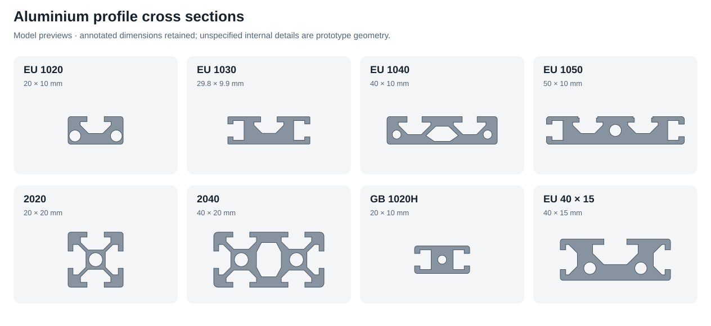

# Aluminium profiles

Open **STRUCTURAL → ALUMINIUM PROFILES → Aluminium extrusion / T-slot profile**. Select a **Profile section**, then a **Cut length**. **Custom dimensions** exposes the cut length, slot dimensions, bore sizes and internal cavity settings. Changing the section resets its cross-section dimensions while retaining the current length. **Top** camera view looks down the extrusion axis to inspect the cross section.



| Section    | Actual width × height | Open slots                      | Internal openings                    | Presets                                    |
| ---------- | --------------------- | ------------------------------- | ------------------------------------ | ------------------------------------------ |
| EU 1020    | 20 × 10 mm            | One top T-slot                  | Two bores, Ø4.2                      | Eleven lengths, 50–550 mm                  |
| EU 1030    | 29.8 × 9.9 mm         | One top T-slot, two side slots  | None                                 | Eleven lengths, 50–550 mm                  |
| EU 1040    | 40 × 10 mm            | Two top T-slots                 | Two bores, Ø3.2, and a centre cavity | Eleven lengths, 50–550 mm                  |
| EU 1050    | 50 × 10 mm            | Two top T-slots, two side slots | One bore, Ø4.3                       | Eleven lengths, 50–550 mm                  |
| 2020       | 20 × 20 mm            | Four face slots                 | One bore, Ø5                         | Reference section; 100 mm prototype length |
| 2040       | 40 × 20 mm            | Six face slots                  | Two bores, Ø5, and a centre cavity   | Reference section; 100 mm prototype length |
| GB1020H    | 20 × 10 mm            | Two side slots                  | One bore, Ø3.2                       | Reference section; 100 mm prototype length |
| EU 40 × 15 | 40 × 15 mm            | One top T-slot, two side slots  | Two bores, Ø4.4                      | Reference section; 100 mm prototype length |

The 48 presets retain the ten supplied reference images. Only the four low EU sections have listed cut lengths, at 50 mm increments. The other section presets deliberately exclude their initial length from verified catalog dimensions. GB1020H keeps the printed width and side-opening tolerances. The three supplied mass-per-metre values remain source specifications and do not change the model's dimensions.

Unspecified cavity widths, bore positions, small radii and internal reliefs are editable prototype geometry. The EU1050 step uses both printed opening widths, 6.2 and 7.2 mm; its step height is illustrative. The 2040 slot depth is derived to preserve the annotated 1.5 mm diagonal web. The 40 × 15 drawing does not print a model code; `eu1540` is only the package's internal identifier. Alloy, temper and material strength are not inferred from the photographs.

The entire implementation is in `src/parts/aluminium-profile`. It can be exported and handed off independently with `npm run parts:export -- aluminium-profile <output-folder>`. Geometry and FreeCAD export share one cross-section definition; the macro creates one solid because each extrusion is a single physical component.

## Verification

`node --import tsx --test tests/aluminium-profile.test.ts` checks source coverage, complete configurations, closed outward meshes, through openings, real undercuts, length scaling, section changes and invalid cavity intersections.

The optional native check is:

```sh
node --import tsx scripts/verify-aluminium-profiles.ts
/Applications/FreeCAD.app/Contents/Resources/bin/python scripts/verify-aluminium-profiles.py
```

Use a FreeCAD-capable Python on other platforms. Local FreeCAD 1.0.2 passed all eight sections: valid closed single solids, nominal bounds, preview/native volume, more than 500 cross-section probes per section, through-length continuity and STEP round trips. Results are recorded in `data/aluminium-profile-native-validation.json`. These native checks do not run in GitHub Pages CI.
